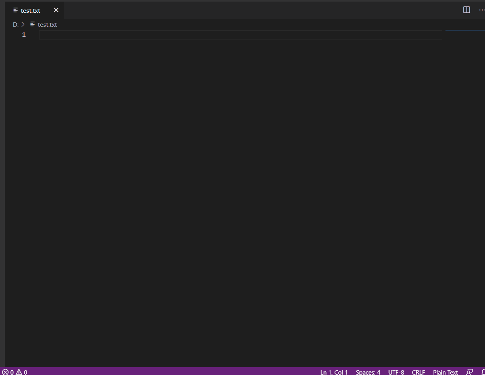

# sais-das-mater README

This VSCode extension adds a command `Display Size` which shows the approximated size of selected text in the active editor. The command assumes the text is encoded in UTF-8.

## Features

After installing the extension, you should have `Sais Das Mater: Display Size` command available in the palette. 

Example use case:
- you have a complex JSON file opened up, and you need to quickly estimate the actual size of the object, or portions of the object

## Requirements

Requires VSCode version ^1.55.0

## Known Issues

- size estimation is based on UTF-8 encoding only

## Release Notes

### 0.0.1

Initial release of the extension.
